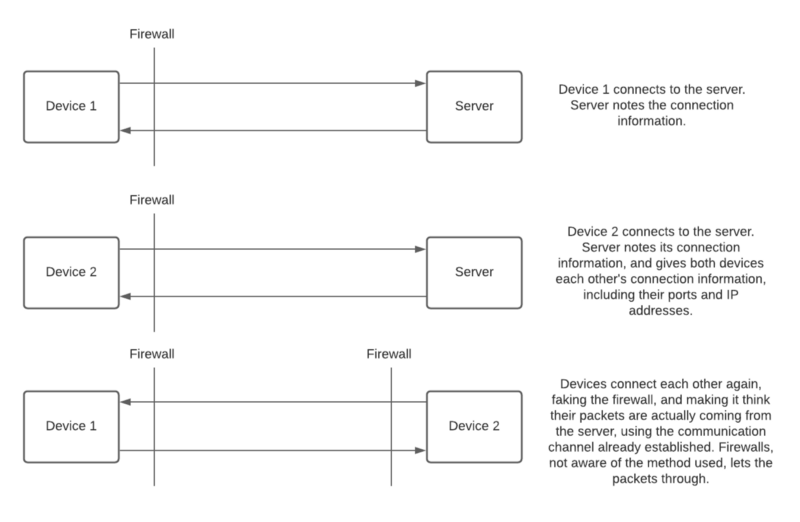
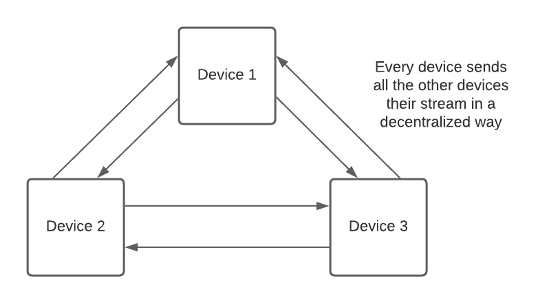
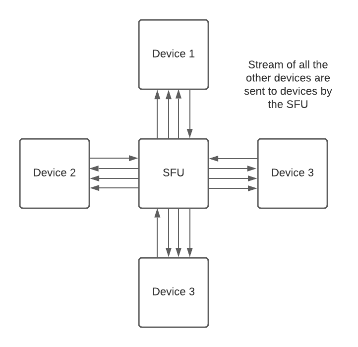
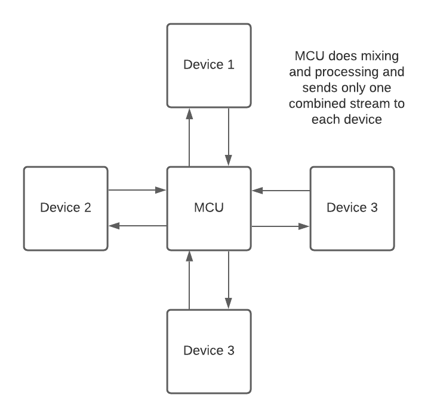

# How Can a Non-Profit Organization Afford toServe Millions of Free Video Calls?: The STUN Protocol

Recently, WhatsApp updated its [privacy policy](https://www.whatsapp.com/legal/updates/privacy-policy). This event, along with the ongoing discussions on privacy concerns about the online platforms we used every day, created interest in fields of privacy and security and migration to other messaging platforms such as Signal.

One of the questions about this event was how End-to-End encryption and open-source will provide privacy and security. I [also wrote an article about this topic](https://fcivaner.medium.com/messaging-open-source-and-end-to-end-encryption-41a0252541bb) recently.

In this article, I will try to explain how a non-profit organization can afford to serve millions of free video calls, without going into technical details of the protocols used as much as possible.

The main point of this article is, **if you are not interested in recording the video calls of other people, you don’t need powerful servers to serve millions of video calls.**

How is this true? Let me explain. It is thanks to the [STUN](https://en.wikipedia.org/wiki/STUN) and a related set of tools and methods.

**Session Traversal Utilities for NAT** (**STUN**) and related methods are invented out of necessity to initiate connections between devices. What they do is, connecting two or more devices **directly** to each other, after they first connect to a server and find each other using it. After the first few steps which take a short time and are very cheap in terms of computing resources, the server is out of the loop. This means a server doesn’t need to exchange any video or audio information between devices, so the people running the servers don’t have to pay for that bandwidth or processing power. Devices create a direct connection with the help of the server in the beginning, and after that, they only use their own bandwidth.

### How Does it Work?

Let’s see how a sample NAT traversal may work. Please note that this is a simplified version of a real scenario, and in reality, there can be many different NAT types and methods, but they are out of the scope of this article.

Usually, when we access the internet, we are behind some kind of firewall or some system that relays network packages coming from outside to internal devices. These two are usually in our router/modem, or in the case of mobile internet access, network devices of our service providers.

The firewall or routing algorithm (It’s also called NAT, for Network Address Translation) is designed to let us connect to the servers we need (e.g. to access websites, to message people), but to block the connection when someone else on the internet tries to connect to our network or device. This is both a security feature and a necessity (If multiple devices are connected to one router and have one IP address, like in your home, your router can’t know which device to relay the connection coming from the outside).

To block connections, it usually tracks where the first packet originated from. If the communication is originated by you, it doesn’t intervene. It also lets the packages after that pass through, thinking a two-way connection is established. If a package is first sent by another external device without prior connection, the firewall just obliterates the package and no one ever sees it.

As you can see, the fact that devices can’t connect directly to each other makes video calls very costly because every device needs to connect to the server and transfer all video data through the server. This is a problem because;

1.  The server will need a huge network bandwidth (MB/s required to transfer live video\*user count) or there should be a lot of servers (more probable).
2.  Users may experience latency because of the server in the middle.
3.  Users can be away from the server, even in a different country, slowing down the communication.

Luckily, there is a solution. It is called NAT traversal, and it works like this:

1.  The devices first connect to the server. The server notes their connection information(IP address, ports).
2.  The server sends the connection information it collected to the devices.
3.  The server steps out of the way and devices connect directly to each other, making the packages seem as if they keep coming from the server using each other’s connection information. Direct connection is established.

In this case, the server doesn't transfer video or audio data at all. It just has to transfer a tiny bit of information only at the beginning, the connection information.

NAT traversal methods are a very important reason why we can make free video calls today. The application of these methods on a large scale lets us reduce the cost of infrastructure required for communication to a very small fraction of what we would have to pay otherwise.

#### But what if traversal doesn’t work?

Usually, when we initiate a video call, our devices try to traverse NAT using the server (Also called the STUN server), and it works. But what if it can’t because of a stubborn firewall, or some other reason?

Then we will need to fall back to the original plan. Tediously transferring everything through the server.

**This is called a TURN (Traversal Using Relays around NAT) server**, and it is usually bundled with the STUN server. A very important thing that any organization running a video call platform should do is to try to keep the percentage of users that fall back to TURN low or if possible, drop them out of calls as the ratio gets higher than the available resources. This is the only way to maintain the health of their servers and manage their spending.

#### Putting It All Together

In conclusion, we can safely say that an organization can keep its costs very low if they keep their direct connection ratio high. This comes at a cost, though: If you make devices connect directly to each other, you can’t record them or eavesdrop on them, simply because you are not in the loop. To do that, you should make it obvious by requesting each device to send an additional stream to the server. Doing this is very normal if you are in a corporate setting, but not that normal or desired if it is a messaging app.

So what are the options that an organization or a company can use if it wants to record the conversations?

### Different Ways To Serve A Video Call

There are many different ways to serve a video call or video conference, and the method we should use to record the call changes with the method used. Let’s take a look at these methods:

#### Mesh

Mesh is the communication method we would use if we want to have the benefits of STUN. In mesh mode, All devices in the conference connect directly to each other and transfer video information. In this case, if the server wants to record the conversation, it should command the devices to create an additional, easy-to-detect connection to the server and send a copy of the video stream there.

#### SFU (Selective Forwarding Unit)

If we are using the SFU method, all video and audio data passes through the server to go to the other devices. If STUN fails and we fall back to TURN, we would also be doing our communications like this. If you are not using End-to-End encryption, the server can record the data as it passes through.

#### MCU (Multipoint Control Unit)

If we are using the MCU method, all video and audio streams are first transferred to the server, and then they are **mixed** in the server. This means the server combines all video and audio into one stream, and then sends this stream to each user. This greatly reduces the number of video streams sent to users, so it makes larger conference calls possible. The downside is, now you;

1.  Can’t have encryption because the server should understand the streams to mix them,
2.  You need a huge server or a collection of servers with an abnormal amount of total computing resources compared to mesh or hybrid solutions to serve the same number of concurrent video calls.

MCU would probably be your pick if you are running a teleconferencing business, or want to do some processing or add effects on the streams on the server.

### Conclusion

In conclusion, an organization that;

1.  Does not intend to record any calls, so it is ok with direct connections between devices
2.  Uses mesh networking mode
3.  Keeps the users that fall back to the TURN solution at a minimum, dropping these calls if necessary
4.  Uses [End-to-End encryption enforced by its clients](https://fcivaner.medium.com/messaging-open-source-and-end-to-end-encryption-41a0252541bb)

**Can serve a very large number of private and secure video or audio calls with a lot less computing resources than an enterprise solution.**